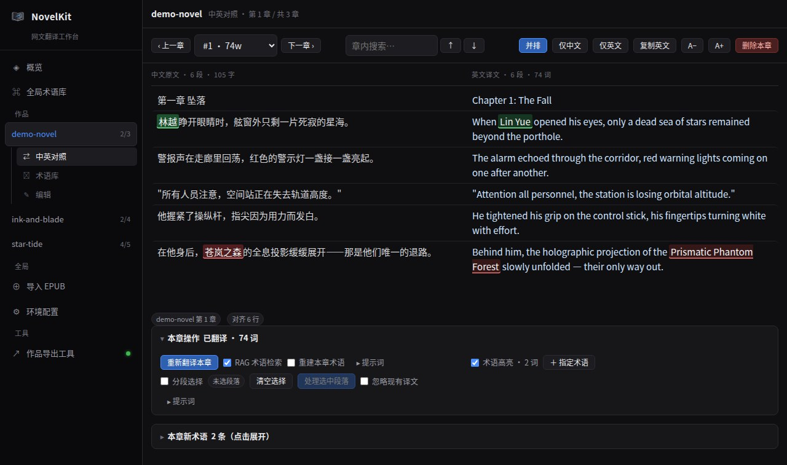
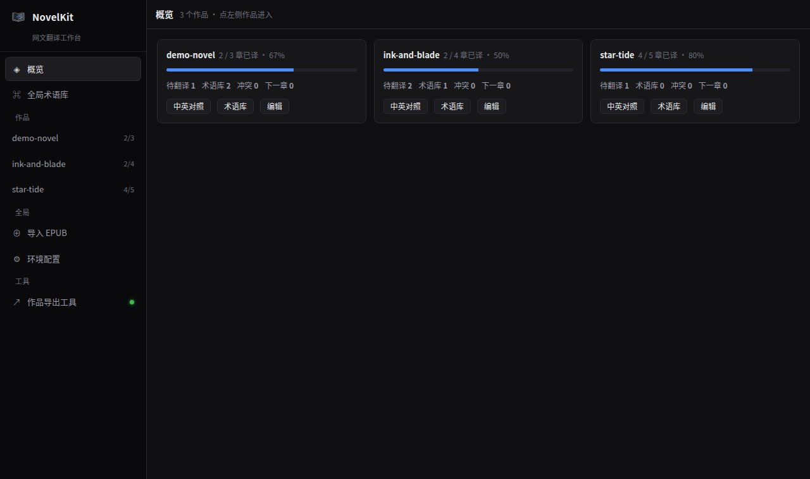
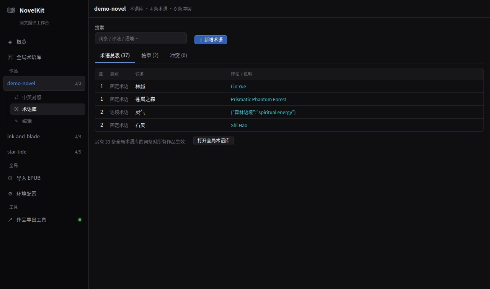
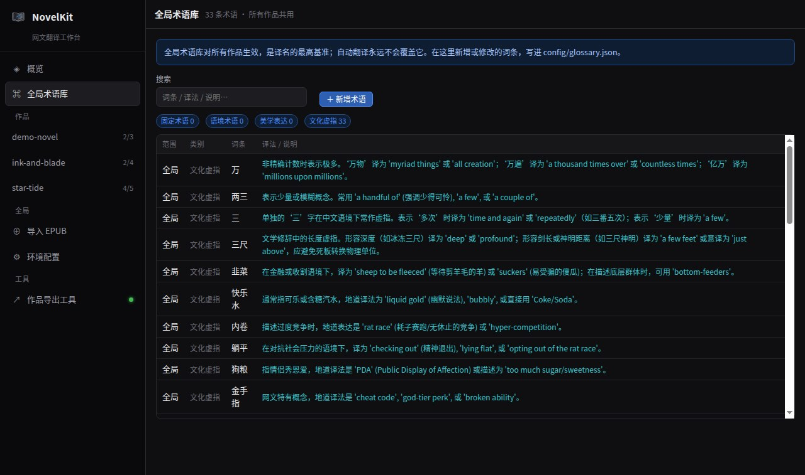
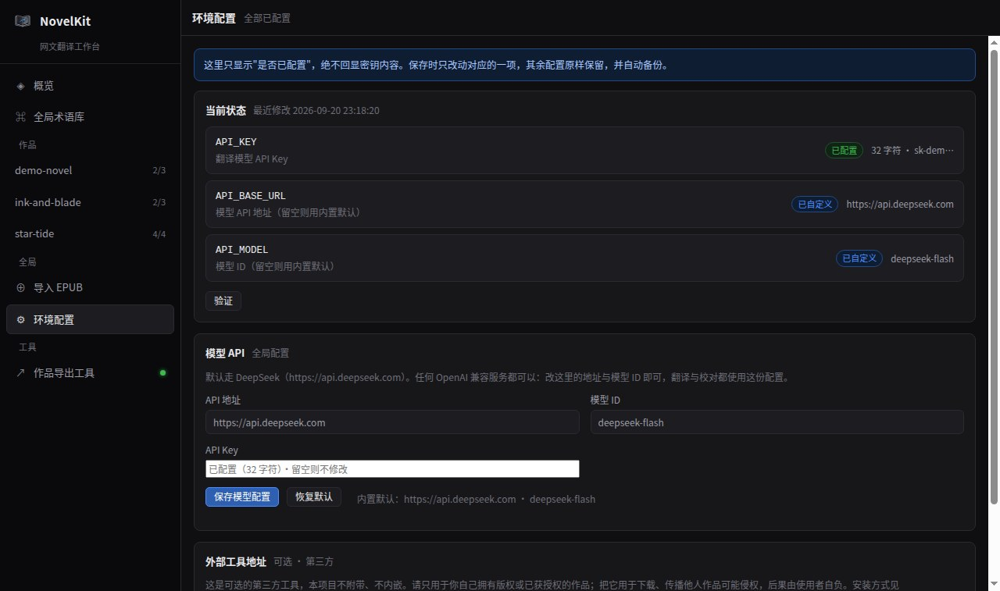

# NovelKit — 网文翻译工作台

> 中文网文 → 地道英文的AI翻译工作台。术语库保证译名一致、RAG 检索消解歧义、
> AI 评审与回译校对、逐段精修留痕。日常使用一个浏览器面板就够了。

## 界面预览

中英对照：原文与译文同屏并排、逐段对齐，术语在中英两侧双向高亮。



| 概览 | 作品术语库 |
| --- | --- |
|  |  |

| 全局术语库（所有作品共用） | 环境配置（模型 API 与外部工具） |
| --- | --- |
|  |  |

> 截图使用自造的示例文本，仅用于演示界面。

## 安装与启动

只需要 `git` 与 Python 3.10+。翻译/回译依赖模型 API（默认 DeepSeek，任何
OpenAI 兼容服务都可以）；EPUB 导入需要上面 `pip install` 装的 Python 依赖；
侧栏的第三方工具是**可选**的，见下文「可选：作品导出工具（第三方）」。

```bash
git clone https://github.com/K-02-b/novelkit.git
cd novelkit
python3 -m venv .venv
.venv/bin/pip install -r requirements.txt
cp .env.example .env            # 填入 API_KEY（默认 DeepSeek）
./webpanel/run.sh --open        # 浏览器打开 http://127.0.0.1:8897/
```

打开面板后：

1. **导入原文** —— 全局「导入 EPUB」，勾选要翻译的章节，导出成一部作品；
2. **配置模型 API** —— 「环境配置」里填 API 地址、模型 ID 与 Key；
3. **翻译** —— 作品的「中英对照」页，底部「本章操作」直接翻译本章，实时看日志；
4. **校对与精修** —— 同一页勾选段落做局部重译与 Refine，术语在「术语库」页维护；
5. **本地编辑** —— 「编辑」页直接改原文与译文，保存前自动备份。

**外部工具（可选）**：侧栏「作品导出工具」只是**同源反向代理**到你**自行安装**的
第三方程序（本项目不附带、不分发）。需要时按
[「可选：作品导出工具」](#可选作品导出工具第三方) 安装并让它只监听本机。
不想用它也不用装，其余功能完全不受影响。

面板默认只监听 `127.0.0.1:8897`，仅本机可访问；要放到云服务器上见
[部署](#部署) 与 [`deploy/cloud.md`](deploy/cloud.md)。

## 面板能做什么

以作品为第一级分类，每部作品有三个视图，数据彼此独立：

```
概览                       ← 全局
全局术语库                 ← 全局：所有作品共用的译名基准
作品
  my-novel   26/766
    ⇄ 中英对照   ⌗ 术语库   ✎ 编辑
全局
  ⊕ 导入 EPUB
  ⚙ 环境配置
工具
  ↗ 作品导出工具            ← 可选，第三方（本项目不附带）
```

| 视图 | 能做什么 |
| --- | --- |
| 中英对照 | 中文原文与英文译文**同屏并排**，逐段对齐（Refine 精修时不注入本章自己确立的术语，方便你直接改掉不顺眼的译法）；并排/仅中文/仅英文、字号、章内搜索（↑/↓ 或回车跳到上下一个命中）、前后章跳转、**删除本章**。再次打开作品会**接着上次读到的那一章**（有简介时首次进入先看简介）。底部「本章操作」可直接**翻译本章**（后台任务、实时日志、可取消）、勾选段落**局部重译**、对选中段落 **Refine 精修** |
| 术语库 | **每部作品一个**：总表（按首次出现章节）、按章明细、冲突流水；手工增删词条，作用范围可选仅本章 / 整本书 / 全局术语库，带实时查重与冲突提示 |
| 全局术语库（侧栏独立入口） | 所有作品共用的译名基准（`config/glossary.json`）：按四类分类列出、可搜索、可新增/修改，带实时查重。它是最高基准，自动翻译永不覆盖 |
| 编辑 | 直接查看和修改这部作品的原文与译文，新建章节；**保存前自动备份**，不会丢失历史版本。底部还能**重命名作品**与**删除整本书**（移入 `works/.trash/` 可恢复） |

全局功能：

| 功能 | 说明 |
| --- | --- |
| 导入 EPUB | 上传或拖入 EPUB → 逐条预览与勾选（**默认勾选简介之后的全部正文条目，只自动排除目录文档**）→ 简介单独作为开头一章导入 → 导出成 `works/<作品>` 下的新作品，**完成后直接进入该作品**并清空导入页 |
| 环境配置 | 一页管好模型 API 与外部工具地址。密钥只显示"是否已配置"，**绝不回显**；保存前备份 |
| 工具 | 可选的外部工具入口（默认「作品导出工具」）。走面板同源反代，云服务器上不用额外开放端口。**本项目不附带该第三方程序**，且只应用于你自己拥有版权或已获授权的作品 |

面板的细节（本章操作、术语高亮、任务不刷页、框选复制等）见
[`webpanel/README.md`](webpanel/README.md)。

## 术语库一致性

译名分三层，优先级从高到低，**下层不能覆盖上层**：

| 层 | 文件 | 谁能写 |
| --- | --- | --- |
| 全局 | `config/glossary.json` | 侧栏「全局术语库」页，或「指定术语 → 全局术语库」，或直接编辑该文件；自动流程**永不覆盖** |
| 作品 | `works/<作品>/glossary.json` | 面板「指定术语 → 整本书」 |
| 章节 | `works/<作品>/glossary_<章号>.json` | 翻译时自动写入；面板「指定术语 → 仅本章」 |

默认**先到先得**：模型给出与既定译法不同的写法时不会静默改掉，而是拦截并写入
`<作品>/glossary_conflicts.jsonl`，在「术语库 → 冲突」页等你判断。确需改动时用
面板的「强制覆盖」或命令行的 `--allow-term-changes`；全局那一层始终不可覆盖。

机制细节与常见问题见 [`docs/glossary.md`](docs/glossary.md)。

### RAG 语境检索（`--rag`）

翻译前自动挑出"可能有特定内涵"的候选词，回到全书（默认只看后文）检索它们的用法语境，
作为**仅用于消歧**的参考喂给模型，并在提示词里明确禁止剧透与复述。

- 候选词优先取人工词条；其余靠新词发现：一个中文片段要同时满足**凝固度**
  （几个字"抱团"，不是跨词拼接）与**自由度**（左右邻字有变化，是独立词而非长词的残余片段），
  且全书不算普遍。命中"叫做/称为/是指/意味着"等定义句式、以及**首次出现在本章**的新概念会额外加权。
- **还会先问一次模型**：让模型自己列出"值得先查全书语境"的词，再把它的提名和启发式候选一起检索。
  提名结果会逐条校验（必须原样出现在本章、2~8 字、不在 `fixed_terms` 里），凭空造词会被丢掉。
  这次调用只多花一次小请求；不想要就加 `--no-rag-ask`，退回纯启发式。
- 片段优先取"像在解释这个词"的句子，并尽量分散在不同章节；预算按词条均摊，
  预算紧张时缩短每条片段，而不是把后面的候选词整块丢掉。
- 默认 10 个词 × 3 条片段、9000 字符预算，可用
  `--rag-terms` / `--rag-snippets` / `--rag-scope` / `--rag-window` / `--rag-budget` 调整。

## 命令行（可选）

面板覆盖了日常操作。需要批量跑、写脚本、或在没有浏览器的机器上工作时，
`scripts/` 下的入口可以直接调用（`--dir` 的相对名字优先在 `works/` 里查找）：

```bash
# 把工作区里 my-novel 尚未翻译的章节翻完
.venv/bin/python scripts/translate.py --dir my-novel --tasks 9999

# 指定章节；--dry-run 只组装提示词，不调用 API、不写文件
.venv/bin/python scripts/translate.py --dir my-novel --chapter "1-4 6 8-9" --dry-run

# 中文残留 / 回译 / AI 评审
.venv/bin/python scripts/check.py --dir my-novel --chapter "1-5" --zh --back --review

# 局部重译选中的段落
.venv/bin/python scripts/retranslate.py --dir my-novel --chapter 12 --rows "3,7-9"
```

| 脚本 | 用途 |
| --- | --- |
| `scripts/translate.py` | 整章翻译（含回译 / 评审 / RAG / 术语库维护） |
| `scripts/check.py` | 中文残留检测、回译、AI 评审 |
| `scripts/retranslate.py` | 只重译选中的段落 |
| `scripts/refine.py` | 逐段点评 + 修订 + 改动理由 |
| `scripts/split_epub.py` | 把 EPUB 拆成一章一个 txt（面板的「导入 EPUB」更好用） |

完整参数、行号约定与文件结构见 [`docs/cli.md`](docs/cli.md)。

## 项目结构

```
config/                 全局配置（人工维护，随仓库走）
  glossary.json         全局术语库（所有作品共用）
  prompt.txt            默认翻译提示词模板
novelkit/               共享基础库
  align.py              Gale-Church 中英段落对齐（支持合并/拆分，不丢不重）
  config.py             .env / API Key / 目录约定（works/ 工作区）
  glossary.py           术语库读写、冲突拦截、tracker
  llm.py                OpenAI 兼容客户端、退避重试、健壮 JSON 抽取
  prompt.py             提示词组装（整章翻译与局部重译共用同一份）
  rag.py                术语上下文检索
  text.py               章节号解析、标点规范化、原子写入
  ui.py                 终端配色与日志
scripts/                命令行入口（详见 docs/cli.md）
  translate.py / check.py / retranslate.py / refine.py / split_epub.py
webpanel/               零依赖 Web 面板（后端纯标准库、前端原生 JS、无构建步骤）
  server.py             HTTP 服务 + 路由 + 静态文件 + 访问令牌
  services/             library / editor / credentials / jobs / import_epub …
  static/               index.html + style.css + js/（按视图拆分的 ES Module，无构建步骤）
works/                  作品工作区：导入的作品都放这里（不入库，可用 NOVELKIT_WORKSPACE 挪走）
deploy/                 云服务器部署：systemd 单元、Nginx 示例、部署指南
docs/                   cli.md（命令行细节）、glossary.md（术语库机制）、images/（README 截图）
tests/                  离线回归测试（网络层打桩，不消耗 API 额度）
```

`.env`、`.venv/`、`works/`、`log/` 都已在 `.gitignore` 里，不会误提交。

## 部署

本机一条命令即可（见文首）。云服务器上需要注意：

```bash
cp webpanel/panel.env.example webpanel/panel.env
TOKEN="$(python3 -c 'import secrets;print(secrets.token_urlsafe(24))')"
sed -i "s|^#\?PANEL_TOKEN=.*|PANEL_TOKEN=$TOKEN|" webpanel/panel.env
chmod 600 webpanel/panel.env
echo "访问令牌：$TOKEN"                 # 记下来，首次登录要用

sudo ./deploy/install-services.sh      # systemd 开机自启
# 没有 systemd 时： ./deploy/services.sh start|stop|restart|status
```

**访问地址**（按你的部署方式选一行）：

| 部署方式 | 打开这个地址 |
| --- | --- |
| 本机（默认，只监听 `127.0.0.1`） | `http://127.0.0.1:8897/` |
| 云服务器 + Nginx 反代（推荐） | `https://你的域名/` |
| 直接监听公网 + 令牌 | `http://<服务器IP>:8897/` |

首次登录用一次性链接：`https://你的域名/?token=<上一步生成的令牌>`（直接监听公网时把域名
换成 `<服务器IP>:8897`）。面板会写入一枚 HttpOnly Cookie 并跳回首页，之后正常打开地址即可，
不用每次带令牌；换浏览器或清了 Cookie 就再登录一次，「环境配置」页有「退出登录」。

> 面板监听非回环地址时**强制要求**访问令牌，没设就拒绝启动。
> 更稳的做法是只监听 `127.0.0.1`，用 Nginx 反代上 HTTPS，防火墙只放 22/80/443。

完整步骤、安全清单与常见问题见 [`deploy/cloud.md`](deploy/cloud.md)。

### 可选：作品导出工具（第三方）

> 面板**不提供**任何内容获取功能。侧栏的「作品导出工具」只是**同源反向代理**到你
> 自己安装的第三方程序（默认 [Tomato-Novel-Downloader](https://github.com/zhongbai2333/Tomato-Novel-Downloader)，
> 作者 [@zhongbai2333](https://github.com/zhongbai2333)，MIT 许可），
> 用来把**你自己作品的原文**导出成本地文本。
>
> ⚠️ 请只处理**你自己创作**、或**已获授权 / 属于公有领域**的作品。下载、翻译、传播
> 他人作品可能侵犯著作权，后果由使用者自负；本项目不分发、不托管任何第三方内容。

按上游 Releases 安装并让它只监听本机：

```bash
mkdir -p ~/.local/share/tomato && cd ~/.local/share/tomato
wget -O TomatoNovelDownloader \
  https://github.com/zhongbai2333/Tomato-Novel-Downloader/releases/download/v2.4.15/TomatoNovelDownloader-Linux_amd64-v2.4.15
chmod +x TomatoNovelDownloader

TOMATO_WEB_ADDR=127.0.0.1:18423 TOMATO_WEB_PASSWORD='换成你的密码' \
  setsid nohup ./TomatoNovelDownloader --server --data-dir "$PWD" \
  > "$PWD/webui.log" 2>&1 &
```

然后在面板「环境配置 → 外部工具地址」确认地址；不想用反代就加 `--no-tool-proxy`
启动面板，侧栏入口会退回直连该地址。

## 配置项

`.env`（已被 `.gitignore` 忽略，权限建议 `600`），面板「环境配置」页可以直接改：

| 键 | 说明 |
| --- | --- |
| `API_KEY` | 翻译模型 API Key（必填） |
| `API_BASE_URL` | 模型 API 地址，留空用内置默认 `https://api.deepseek.com` |
| `API_MODEL` | 模型 ID，留空用内置默认 `deepseek-flash` |
| `NOVELKIT_WORKSPACE` | 可选：作品工作区位置，默认 `<项目根>/works/` |

面板运行参数可选写进 `webpanel/panel.env`：`PANEL_HOST`、`PANEL_PORT`（默认 8897）、
`PANEL_TOKEN`、`PANEL_TOOL_PROXY`；命令行也可传 `--host` / `--port` / `--token` / `--no-tool-proxy`。

## 测试

全部离线（网络层打桩，不消耗 API 额度）：

```bash
.venv/bin/python tests/test_novelkit.py      # 基础库：术语库 / RAG / 对齐 / 提示词
.venv/bin/python tests/test_glossary_rag.py  # 术语库规则与检索
.venv/bin/python tests/test_local_api.py     # 本地 API 调用
.venv/bin/python tests/test_webpanel.py      # 面板服务、路由、编辑与任务
```

## 使用须知与合规

- 请只翻译你**拥有版权或已获授权**的作品（自己的作品、授权翻译、公有领域文本）。
- 本工具**不提供**任何内容获取功能；侧栏的「作品导出工具」只是转发到你自行安装的第三方程序，
  只应用于**你自己创作、或已获授权 / 属于公有领域**的作品。下载、翻译、传播他人作品可能
  侵犯著作权，其用途与法律边界由你自己判断，本项目不承担相应责任。
- 把译文**发布**到任何平台、以及下载他人作品，都可能涉及信息网络传播行为；
  未经许可的这两件事都可能构成侵权。本项目只做本地翻译与校对，不对你的使用方式负责。
- 分享日志前先脱敏：`log/`、`*_review.txt` 里可能包含完整提示词与正文。

## 许可

见 [LICENSE](LICENSE)。
